# Smarter-MCP Architecture

This document explains how Smarter-MCP turns Python code into a FastMCP server.
It focuses on the current code in this repository, not only the long-term product
vision.

## Big Picture

Smarter-MCP has three major jobs:

1. Find Python callables that can become MCP tools or resources.
2. Normalize them into one internal registry.
3. Build a FastMCP server that wraps calls with coercion, instance handling, and
   multimodal conversion.

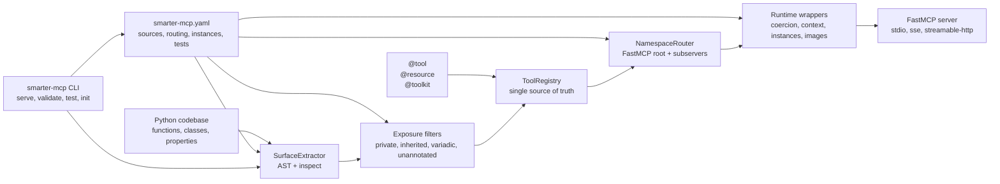

## Package Map

```mermaid
flowchart TB
    Root["src/smarter_mcp"]

    Root --> App["server/app.py<br/>SmarterMCP facade"]
    Root --> Config["config/manifest.py<br/>Pydantic YAML models"]
    Root --> Extractor["extractor/*<br/>source discovery and metadata"]
    Root --> Registry["_registry.py<br/>registered tools/resources/toolkits"]
    Root --> Schema["_schema.py<br/>JSON schema builder"]
    Root --> Runtime["runtime/*<br/>wrappers, coercion, instances"]
    Root --> Multi["multimodal/*<br/>image input/output bridge"]
    Root --> Router["server/router.py<br/>namespace FastMCP mounting"]
    Root --> CLI["cli/*<br/>click commands and target detection"]
    Root --> Testing["_testing.py<br/>tool test runner"]
    Root --> Errors["errors.py<br/>structured error types + formatter"]
    Root --> Security["server/security.py<br/>API-key auth + rate limiting"]
    Root --> Endpoints["server/health.py + schema_endpoint.py<br/>HTTP introspection"]
    Root --> Export["export/*<br/>export placeholder"]
    Root --> LLM["llm/*<br/>description generation (OpenAI SDK)"]
```

## Entry Points

There are four ways code enters the system.

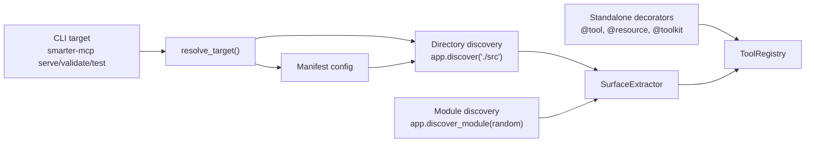

### Programmatic API

The main user-facing class is `SmarterMCP` in `server/app.py`.

```python
from smarter_mcp import SmarterMCP, tool

app = SmarterMCP("example")

@tool()
def add(a: int, b: int) -> int:
    return a + b

app.run()
```

### CLI API

The CLI is defined in `cli/main.py`.
 start a server
smarter-mcp validate <target>    build and print exposed tools/resources
smarter-mcp test <target>       
```text
smarter-mcp serve <target>       run registered test cases
smarter-mcp init <path>          scaffold smarter-mcp.yaml
smarter-mcp export               placeholder command
```

## Build Lifecycle

`SmarterMCP.build()` is the central assembly line.

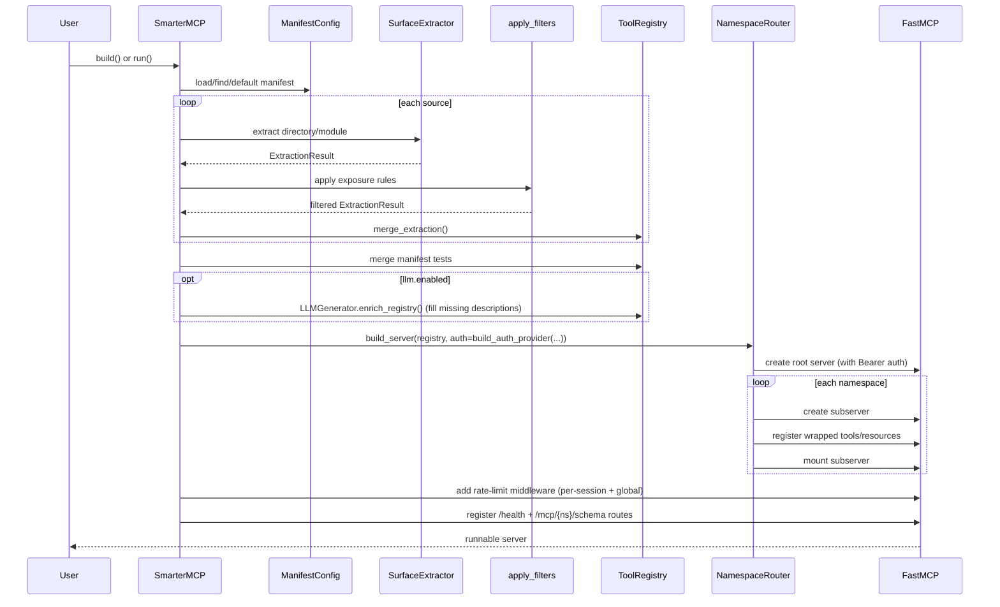

`run()` and `http_app()` additionally wrap the ASGI app with the `X-API-Key`
middleware when `auth_enabled` is set. LLM enrichment, auth, and rate limiting
are all opt-in and fail-soft: a missing LLM key/package logs a warning and the
build proceeds.

## Control Plane: Manifest Config

`config/manifest.py` defines the YAML control plane. The manifest decides what
to scan, what to expose, how to route namespaces, and how class instances should
be created.

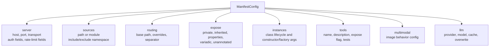

The `server` auth and rate-limit fields are fully wired: `build()` constructs a
Bearer auth provider and rate-limit middleware from them, and `http_app()`/`run()`
attach the `X-API-Key` ASGI middleware. The `llm` block drives optional
description generation during `build()`. See
[Server Security](#server-security-auth--rate-limiting) and
[LLM Description Generation](#llm-description-generation) below.

## Extraction Engine

The extraction engine lives in `extractor/surface.py` and produces the metadata
models from `extractor/models.py`.

It uses two passes:

1. AST pass: parse source files without importing them.
2. Inspect pass: optionally import modules to improve signatures and detect
   runtime details.

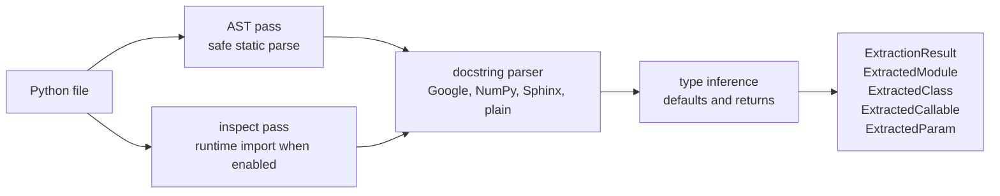

The core intermediate representation looks like this:

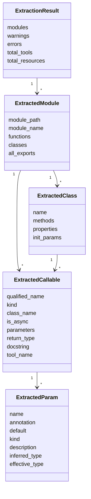

## Filtering

After extraction, `extractor/filters.py` applies exposure rules. This is where
the system decides which discovered callables are safe and useful enough to
publish.

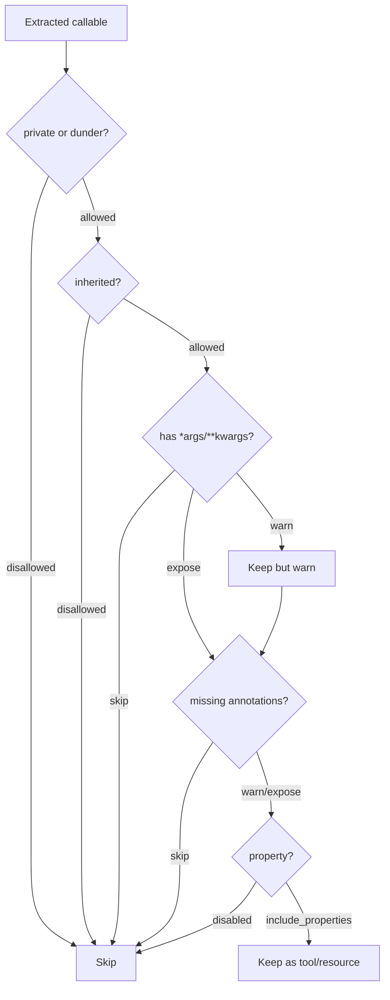

## Registry: The Internal Source of Truth

`_registry.py` stores everything after decorators and discovery converge.

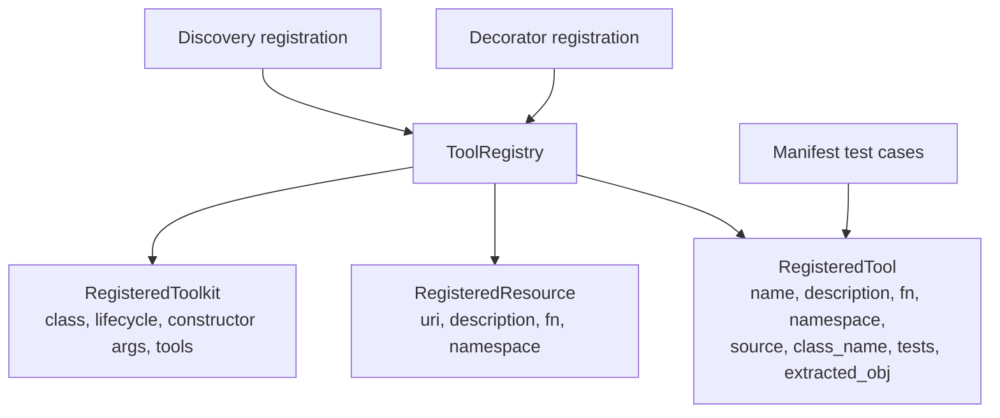

The registry deliberately separates "what exists" from "how FastMCP serves it".
That makes the same metadata usable by:

- `NamespaceRouter` for serving
- `_schema.py` for schema generation
- `_testing.py` for tool tests
- CLI validation output

## Routing and FastMCP Mounting

`server/router.py` turns registry entries into FastMCP servers. The root server
mounts one subserver per namespace.

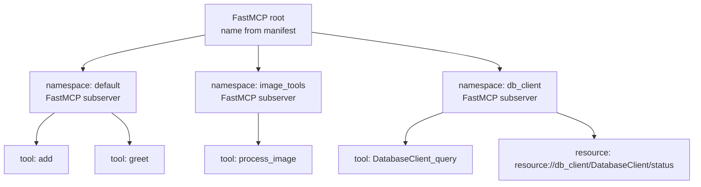

Tool names are generated as follows:

| Python surface | MCP name |
|---|---|
| `def add(...)` | `add` |
| `class Client: def query(...)` | `Client_query` |
| Manifest override with `name:` | override wins |

## Runtime Call Path

Every served tool is wrapped by `runtime/tool_wrapper.py` before FastMCP receives
it.

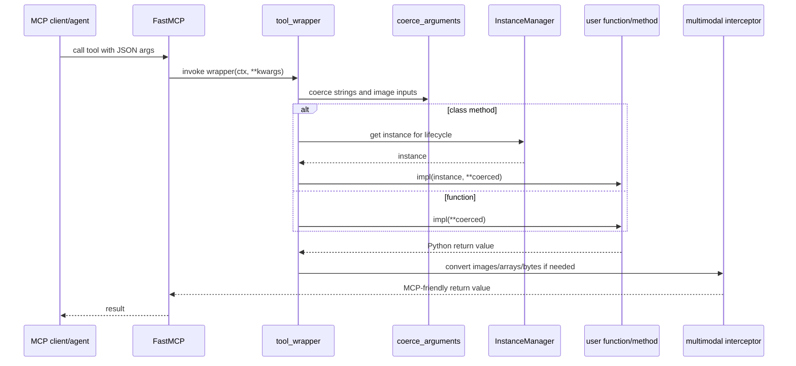

Error behavior: wrappers catch exceptions and **return** a structured error
object rather than letting a raw traceback escape to the agent. `CoercionError`
becomes a `coercion_error` payload (bad input); any other exception becomes an
`execution_error` payload. See [Structured Error Handling](#structured-error-handling).

## Type Coercion

`runtime/coercion.py` tries to adapt common LLM/client argument shapes to the
Python types expected by the underlying callable.

```mermaid
flowchart LR
    Raw["Raw JSON/FastMCP arg"]
    Type["Expected Python type"]
    Coerce["coerce_arguments()"]
    Out["Python value"]

    Raw --> Coerce
    Type --> Coerce
    Coerce --> Out

    S1["'42' + int"] --> I1["42"]
    S2["'true' + bool"] --> I2["True"]
    S3["'{\"a\":1}' + dict"] --> I3["{'a': 1}"]
    S4["'[1,2]' + list"] --> I4["[1, 2]"]
    S5["base64/path/url + PIL.Image"] --> I5["PIL.Image.Image"]
    S6["base64/path/url + ndarray"] --> I6["numpy.ndarray"]
```

If coercion fails for a simple type, `coercion.py` raises `CoercionError`. The
tool wrapper catches it and returns a structured `coercion_error` response, so
the agent gets a clear "bad input" signal it can act on instead of a traceback.

## Instance Lifecycle

`runtime/instances.py` controls class construction for class-based tools.

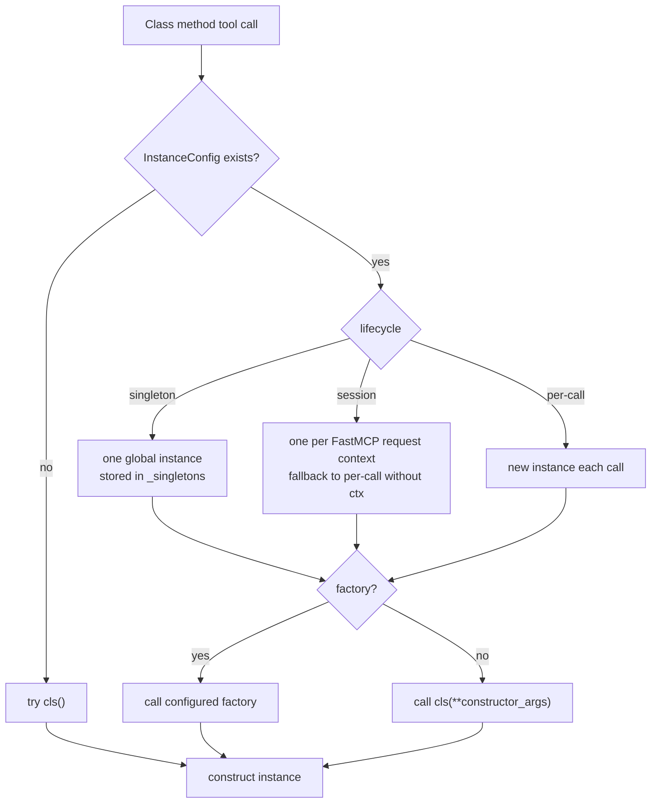

Lifecycle choices:

| Lifecycle | Good for | Trade-off |
|---|---|---|
| `session` | per-client state, authenticated clients, caches | needs MCP context; direct tests fall back |
| `singleton` | shared clients, expensive setup | shared mutable state must be safe |
| `per-call` | stateless utilities, simple isolation | more construction overhead |

## Multimodal Handling

`multimodal/interceptor.py` bridges Python image objects and FastMCP image
content.

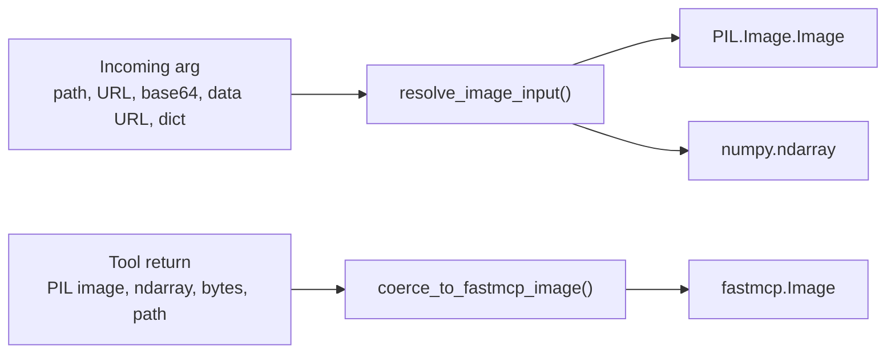

The multimodal dependencies are optional. Pillow and NumPy are imported lazily,
and missing extras raise a clearer installation message when an image conversion
actually needs them.

## Schema Generation

`_schema.py` builds JSON schemas from either extracted metadata or live function
signatures.

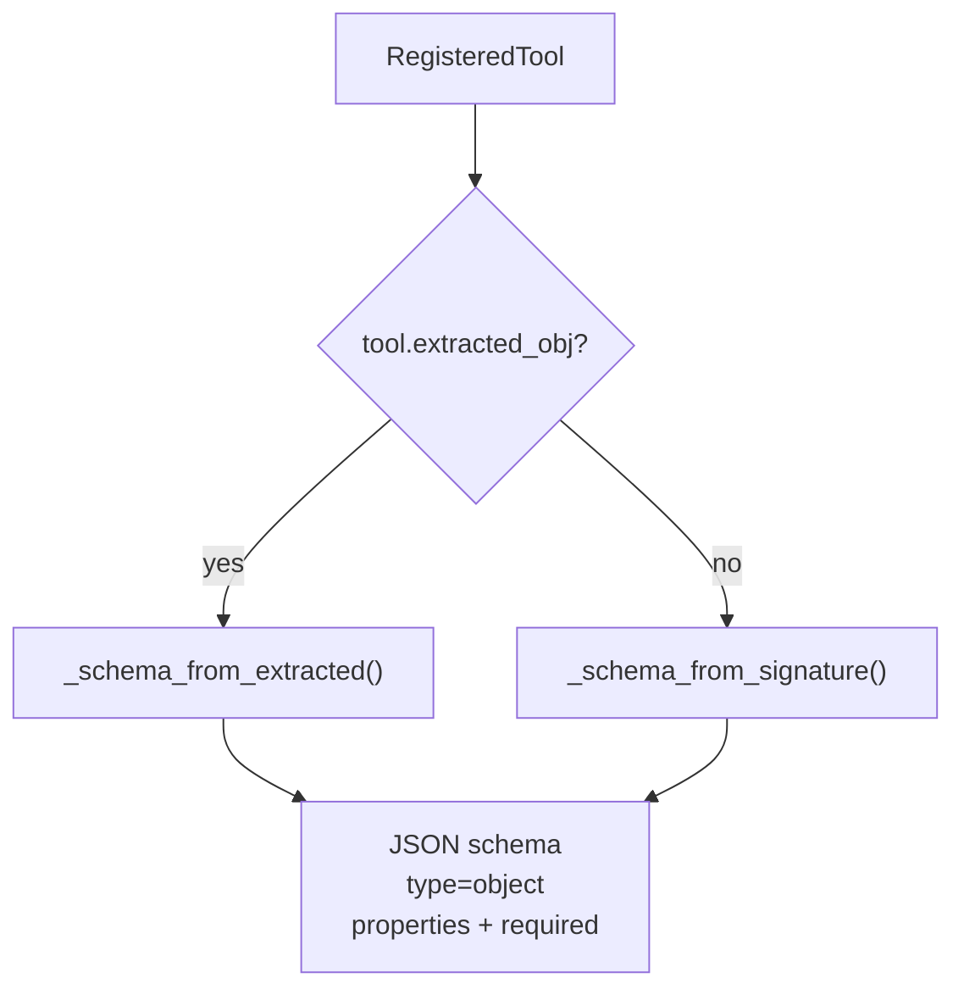

Multimodal parameters are exposed as strings in schema output, with descriptions
that hint at file paths or remote URLs. The runtime wrapper also rewrites complex
image annotations to `str` in its public signature to keep FastMCP/Pydantic
registration compatible.

## Tool Testing Framework

`_testing.py` lets developers verify registered tools before exposing them to
agents.

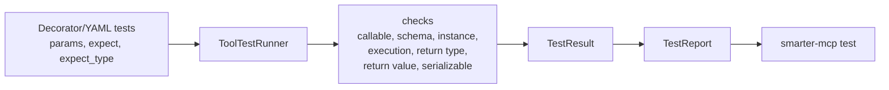

The same runner powers:

- `app.test()`
- `app.test("tool_name")`
- `app.test("tool_name", params={...})`
- `smarter-mcp test`

## Structured Error Handling

`errors.py` defines the error hierarchy and the JSON formatter. The runtime
wrappers in `runtime/tool_wrapper.py` use them to turn any failure into a
machine-readable object.

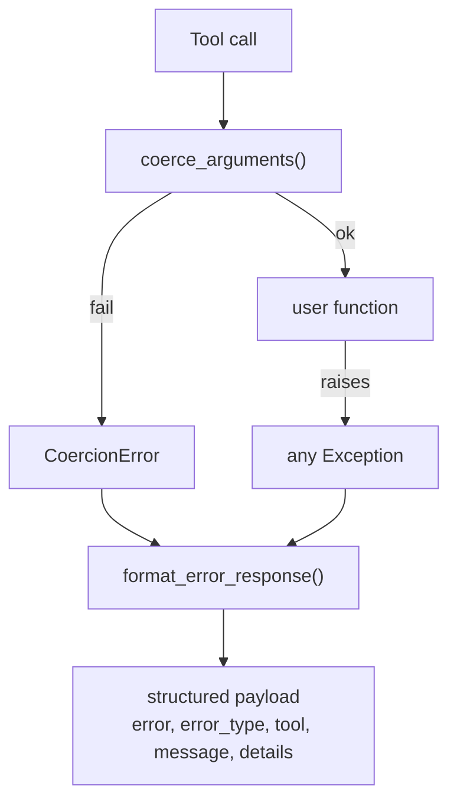

| Source | `error_type` | Logged at |
|---|---|---|
| `CoercionError` (bad input) | `coercion_error` | `warning` |
| Any other exception (internal) | `execution_error` | `error` (+ traceback) |

The agent only ever sees the clean payload; full tracebacks stay in the logs.

## HTTP Endpoints & Introspection

`server/health.py` and `server/schema_endpoint.py` back two custom Starlette
routes registered on the FastMCP server during `build()`.

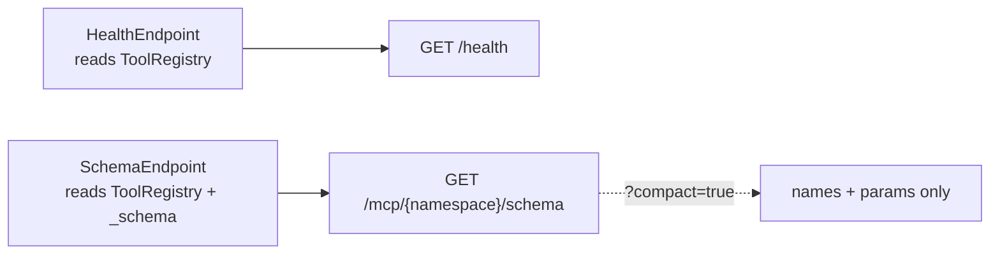

- `/health` reports `status`, `name`, `namespaces`, `tool_count`, `resource_count`
  (counts read straight from the registry). Always exempt from auth.
- `/mcp/{namespace}/schema` returns OpenAPI 3.1 JSON; `?compact=true` returns a
  trimmed `{namespace, tools:[{name, params}]}` for large surfaces. Unknown
  namespaces return `{"error": ...}`.

## Server Security: Auth & Rate Limiting

`server/security.py` centralizes all security construction so `build()`,
`http_app()`, and `run()` share one source of truth. Everything is off unless
enabled in the `server` config.

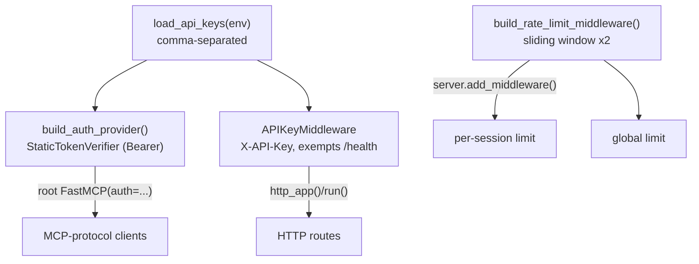

- **Auth (two layers, one key set):** a custom `X-API-Key` ASGI middleware guards
  HTTP routes, and a FastMCP-native `StaticTokenVerifier` guards the MCP protocol
  (`Authorization: Bearer <key>`). Keys come from `auth_keys_env`.
- **Rate limiting:** two `SlidingWindowRateLimitingMiddleware` instances — one
  per-session (keyed by MCP session id), one global. Attaching to the server
  object means limits also apply to in-memory `fastmcp.Client` connections.

## LLM Description Generation

`llm/generator.py` enriches the registry with LLM-written descriptions for tools
that lack them; `llm/client.py` is the OpenAI-SDK backend.

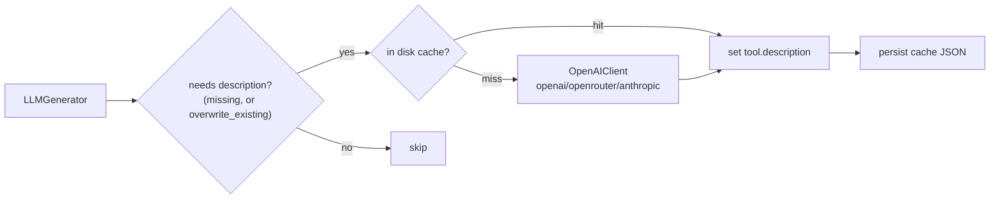

- Runs during `build()` when `llm.enabled`, after discovery and before routing.
- **Cache** keyed by `sha256(signature + docstring)` — unchanged code = zero calls.
- **Fail-soft:** a missing key/`openai` package logs a warning and the build
  proceeds; the client is built lazily, so nothing is required if no tool needs a
  description.
- v1 uses the OpenAI SDK only; `provider` selects the base URL + key env var
  (`openai` / `openrouter` / `anthropic`).

## Current Feature Status

```mermaid
flowchart LR
    Done["Implemented and tested"]
    Partial["Partial / config exists"]
    Planned["Remaining checklist"]

    Done --> Testing["Tool testing framework"]
    Done --> Multi["Multimodal interception"]
    Done --> CLI["CLI serve/validate/init/test/export stub"]
    Done --> Extract["Discovery/extraction/filtering"]
    Done --> Routing["Namespace routing"]
    Done --> Errors["Structured error responses"]
    Done --> Health["HTTP health/schema endpoints"]
    Done --> AuthImpl["Auth (X-API-Key + Bearer)"]
    Done --> RateImpl["Rate limiting (sliding window)"]
    Done --> LLMImpl["LLM description generation (OpenAI SDK)"]

    Partial --> ExportStub["Export command stub"]

    Planned --> ExportImpl["Package export implementation"]
    Planned --> LLMv2["LLM v2 (LiteLLM, param-level descriptions)"]
```

## End-to-End Mental Model

Think of Smarter-MCP as a compiler-like pipeline:

```text
Python source/decorators/YAML
        |
        v
Extraction + registration
        |
        v
Internal registry
        |
        v
FastMCP routing
        |
        v
Runtime wrapper
        |
        v
User code executes
        |
        v
MCP-friendly response
```

The most important boundary is the registry. Everything before it is about
discovering and normalizing Python surfaces. Everything after it is about
serving those surfaces safely and ergonomically through FastMCP.

